# AssetFlow Launch Demo — Pure Action Shot Storyboard

> **Duration:** 45–60 seconds  
> **Format:** Hyperframes composition (programmatic video)  
> **Target:** HeyGen Hackathon judges & developer community  
> **Tone:** Fast-paced, kinetic typography, terminal-driven  
> **Audio:** Instrumental only — no voiceover, no avatar

---

## 🎬 Philosophy

No talking heads. No voiceovers. The product speaks through its own terminal output. Every scene is either:
- **SVG animation** (typing text, pulsing grids, code blocks)
- **Screen recording** (actual AssetFlow CLI executing)
- **Kinetic typography** (terminal characters flying across screen)

The music and sound design carry the emotional arc.

---

## 🏗️ Composition Structure

```text
Timeline (all durations in seconds):
├── 00:00.0 - 00:04.0  →  BEAT 1: Logo crash + grid reveal
├── 00:04.0 - 00:08.0  →  BEAT 2: Problem statement (glitch)
├── 00:08.0 - 00:18.0  →  BEAT 3: Terminal origin story (typing)
├── 00:18.0 - 00:28.0  →  BEAT 4: Pipeline montage (rapid fire)
├── 00:28.0 - 00:38.0  →  BEAT 5: HTML injection (code → render)
├── 00:38.0 - 00:45.0  →  BEAT 6: Showcase UI scroll
├── 00:45.0 - 00:52.0  →  BEAT 7: Install command (one-liner)
└── 00:52.0 - 00:55.0  →  BEAT 8: Logo lockup
```

---

## 🎨 SVG Asset Inventory

All assets are generated as SVG for crisp scaling in Hyperframes.

| File | Scene | Description |
|---|---|---|
| `assets/demo/scene_01_cover.svg` | BEAT 1 | `assetflow_cover.svg` with animated grid pulse |
| `assets/demo/scene_02_glitch.svg` | BEAT 2 | Glitch text: "HALLUCINATED PATHS" |
| `assets/demo/scene_03_terminal.svg` | BEAT 3 | Terminal window with typing animation frames |
| `assets/demo/scene_04_pipeline.svg` | BEAT 4 | 4-up command grid (trim, normalize, generate, measure) |
| `assets/demo/scene_05_html.svg` | BEAT 5 | HTML code block + Hyperframes output split |
| `assets/demo/scene_06_ui.svg` | BEAT 6 | Gallery cards with provider badges |
| `assets/demo/scene_07_install.svg` | BEAT 7 | Install command with typing animation |
| `assets/demo/scene_08_endcard.svg` | BEAT 8 | Logo + tagline lockup |

---

## 📝 Scene-by-Scene Breakdown

### BEAT 1: COVER CRASH (00:00–00:04)
**Hyperframes block:** `data-start="0" data-duration="4"`

**Visual:**
- `assets/demo/scene_01_cover.svg` — full bleed
- Grid lines expand from center outward (scale 0→1)
- Cyan glow pulses once
- "UNIVERSAL ASSET ROUTER" badge slides in from left
- "AssetFlow" title drops with a bounce

**Sound design:**
- Single deep bass hit at 00:00.000
- High-pitched digital "ping" at 00:02.500 when badge locks

**No voiceover.** Text does all the talking.

---

### BEAT 2: PROBLEM GLITCH (00:04–00:08)
**Hyperframes block:** `data-start="4" data-duration="4"`

**Visual:**
- `assets/demo/scene_02_glitch.svg` — full bleed dark background
- Three lines of text glitch in sequentially:
  1. `❌ HALLUCINATED PATHS` (red, glitch effect)
  2. `❌ WRONG TIMELINE MATH` (red, 0.3s delay)
  3. `❌ BROKEN SCREEN RECORDINGS` (red, 0.6s delay)
- Each line shakes horizontally for 0.1s then stabilizes
- Background has scanline overlay

**Sound design:**
- Static/digital noise burst per glitch line
- Subtle descending tone (like an error chime)

---

### BEAT 3: TERMINAL ORIGIN (00:08–00:18)
**Hyperframes block:** `data-start="8" data-duration="10"`

**Visual:**
- `assets/demo/scene_03_terminal.svg` — terminal window centered
- Commands type themselves out (frame-by-frame animation via SVG `<animate>`)
- Each command followed by a ✅ checkmark that scales in

**Commands typed:**
```
$ node scripts/list_local_assets.js
[ "raw_demo.mp4", "loom_2024.mp4", "logo.png" ]
✅

$ node scripts/generate_avatar.js "Welcome to AssetFlow!" intro.mp4
[AssetFlow] Generating... Polling... Done.
✅

$ node scripts/get_media_duration.js intro.mp4
5.23
✅
```

**Animation pacing:**
- Each line types at 30 chars/second
- 0.5s pause after each ✅
- Cyan cursor blinks at bottom when idle

**Sound design:**
- Keyboard clack per character (subtle, rhythmic)
- Success chime on each ✅

---

### BEAT 4: PIPELINE MONTAGE (00:18–00:28)
**Hyperframes block:** `data-start="18" data-duration="10"`

**Visual:**
- `assets/demo/scene_04_pipeline.svg` — 2×2 grid of terminal mini-windows
- Each window executes one command, then turns green when done
- Sequence:
  1. **Trim** window: `smart_trim.js` → green at 00:20
  2. **Normalize** window: `normalize_video.js` → green at 00:22
  3. **Generate** window: `generate_ideogram.js` → green at 00:24
  4. **Measure** window: `get_media_duration.js` → "10.00" → green at 00:26
- At 00:27, all four windows shrink and fly toward center, merging into a single timeline diagram

**Timeline diagram (appears at 00:27):**
```
0.00s ├─→ Intro (5.23s) ─┤
5.23s ├─→ Demo (10.00s) ─┤
15.23s└─→ Outro (4.10s) ─┘
```

**Sound design:**
- Faster keyboard clacks (montage energy)
- Four ascending chimes (one per window completion)
- Whoosh sound when windows merge

---

### BEAT 5: HTML INJECTION (00:28–00:38)
**Hyperframes block:** `data-start="28" data-duration="10"`

**Visual:**
- Split screen via `assets/demo/scene_05_html.svg`
- **Left half:** HTML code types itself out
- **Right half:** Hyperframes player renders the video in real-time
- As each `<div>` completes on the left, the corresponding segment plays on the right

**HTML typed:**
```html
<div data-start="0" data-duration="5.23">
  <video src="assets/intro.mp4" />
</div>
<div data-start="5.23" data-duration="10.00">
  <video src="assets/feature.mp4" />
</div>
<div data-start="15.23" data-duration="4.10">
  <video src="assets/outro.mp4" />
</div>
```

**Right half renders:**
- 00:30 — intro avatar clip plays (5.23s)
- 00:32 — feature demo clip plays (10.00s)
- 00:34 — outro clip plays (4.10s)

**At 00:36:** Full-screen flash to white, then back to dark with:
```
ZERO GUESSWORK. ZERO BROKEN TIMELINES.
```
(text centered, cyan glow)

**Sound design:**
- Rhythmic typing on left
- Video playback swoosh on right
- White flash accompanied by cymbal crash / impact hit

---

### BEAT 6: SHOWCASE UI (00:38–00:45)
**Hyperframes block:** `data-start="38" data-duration="7"`

**Visual:**
- `assets/demo/scene_06_ui.svg` — horizontal scroll of AssetFlow UI cards
- Cards slide in from right, one every 1.5s:
  1. 🎬 `generate_avatar.js` — HeyGen badge
  2. 🎙 `generate_elevenlabs.js` — ElevenLabs badge
  3. 🖼 `generate_ideogram.js` — Ideogram badge
  4. ✂️ `smart_trim.js` — FFmpeg badge
  5. 📊 `get_media_duration.js` — Utility badge
- Each card has a "Copy Agent Prompt" button that flashes cyan when hovered
- At 00:43, all cards stack into a deck, then fan out like a hand of cards

**Sound design:**
- Card slide-in: soft "whoosh" per card
- Hover flash: digital "tick"
- Fan-out: shuffling sound

---

### BEAT 7: INSTALL COMMAND (00:45–00:52)
**Hyperframes block:** `data-start="45" data-duration="7"`

**Visual:**
- `assets/demo/scene_07_install.svg` — full-screen terminal
- Command types itself out slowly (character by character)
- Background is `assetflow_cover.svg` with heavy blur + dark overlay

**Typed command:**
```bash
curl -sSL https://raw.githubusercontent.com/
  open-biz/assetFlow-skill/main/install.sh | bash
```

**After typing completes (00:49):**
- Output appears:
```
✅ Cloned assetFlow-skill
✅ Installed dependencies
✅ Copied .env.example → .env
✅ FFmpeg detected
Done in 8.3 seconds.
```

**At 00:51:** Zoom out to reveal the command is inside a browser window showing the GitHub repo

**Sound design:**
- Deep bass pulse on first character
- Rhythmic typing (slower, more deliberate than Beat 3)
- Success chime sequence (4 ascending tones)
- Final zoom-out: airy "swoosh"

---

### BEAT 8: END CARD (00:52–00:55)
**Hyperframes block:** `data-start="52" data-duration="3"`

**Visual:**
- `assets/demo/scene_08_endcard.svg`
- Dark background, centered logo
- "AssetFlow" text draws itself (SVG stroke animation)
- Below it: "Universal Asset Router for AI Video Agents"
- GitHub URL fades in below: `github.com/open-biz/assetFlow-skill`
- Cyan horizontal line extends from center outward (0.5s)

**Sound design:**
- Logo draw: pencil-on-paper texture sound
- Line extend: digital "sweep"
- Final beat: single deep bass hit + silence

---

## 🛠️ Asset Production Guide

### SVG Scene Assets

All scenes are delivered as SVG with embedded SMIL animations (`<animate>`, `<animateTransform>`). This ensures they render natively in Hyperframes without requiring external CSS or JS.

#### Scene 01: Cover (`scene_01_cover.svg`)
- Reuses `assetflow_cover.svg` as base
- Adds `<animateTransform>` for grid expansion
- Adds `<animate>` for glow pulse

#### Scene 02: Glitch (`scene_02_glitch.svg`)
- Text paths with `<filter>` for RGB split effect
- `<animate>` on `dx`/`dy` for shake
- Scanline pattern overlay

#### Scene 03: Terminal (`scene_03_terminal.svg`)
- Terminal chrome matching `assetflow_cover.svg`
- Each line uses `<text>` with `<animate>` on `opacity` for typing reveal
- Checkmarks use `<animateTransform>` for scale-in
- Blinking cursor via `<animate>` on `opacity`

#### Scene 04: Pipeline (`scene_04_pipeline.svg`)
- Four terminal mini-windows (200×150 each)
- Each has independent typing animation
- Green fill transition via `<animate>` on `fill`
- Merge animation via `<animateTransform>` on `translate`

#### Scene 05: HTML Injection (`scene_05_html.svg`)
- Split layout: 50% code, 50% player
- Code side: syntax-highlighted HTML with typing animation
- Player side: placeholder rectangles that "light up" in sequence
- Flash effect: white `<rect>` with `<animate>` on `opacity`

#### Scene 06: UI Gallery (`scene_06_ui.svg`)
- Card components with rounded corners, badges, icons
- Slide-in via `<animateTransform>` on `translateX`
- Hover state simulated with `<animate>` on `stroke` color
- Fan-out via `<animateTransform>` on `rotate` (around a pivot)

#### Scene 07: Install (`scene_07_install.svg`)
- Terminal window with blurred `assetflow_cover.svg` background
- Typing animation on multi-line command
- Checklist items with staggered reveal
- Zoom-out simulated via `<animateTransform>` on `scale`

#### Scene 08: End Card (`scene_08_endcard.svg`)
- Text stroke animation via `<animate>` on `stroke-dashoffset`
- Centered layout with generous whitespace
- Cyan line with `<animate>` on `width` + `x`

---

## 🎵 Music & Sound Design Spec

**No voiceover. Music carries the narrative.**

| Timestamp | Mood | Sound |
|---|---|---|
| 00:00 | Impact | Deep bass hit + digital ping |
| 00:04 | Tension | Static noise, error chimes |
| 00:08 | Discovery | Rhythmic keyboard, curiosity |
| 00:18 | Acceleration | Faster rhythm, ascending energy |
| 00:28 | Climax | Full synth pad, cymbal crash |
| 00:38 | Cool down | Shuffling, lighter rhythm |
| 00:45 | Resolution | Slower, deliberate, confident |
| 00:52 | Finality | Single impact, silence |

**Recommended style:** Cyberpunk / lo-fi electronic / ambient techno  
**BPM:** 128–140  
**Source:** Generate with Udio, Suno, or license from Epidemic Sound

---

## 🚀 Hyperframes Composition

Create `demo-composition.html` with all scenes as `<div>` blocks:

```html
<!DOCTYPE html>
<html>
<head>
  <meta charset="UTF-8">
  <style>
    body { margin: 0; background: #0c1324; overflow: hidden; }
    .scene { position: absolute; top: 0; left: 0; width: 100%; height: 100%; }
    .scene img, .scene svg { width: 100%; height: 100%; object-fit: cover; }
  </style>
</head>
<body>

  <!-- BEAT 1: Cover -->
  <div data-start="0" data-duration="4" class="scene">
    
  </div>

  <!-- BEAT 2: Glitch -->
  <div data-start="4" data-duration="4" class="scene">
    
  </div>

  <!-- BEAT 3: Terminal -->
  <div data-start="8" data-duration="10" class="scene">
    
  </div>

  <!-- BEAT 4: Pipeline -->
  <div data-start="18" data-duration="10" class="scene">
    
  </div>

  <!-- BEAT 5: HTML Injection -->
  <div data-start="28" data-duration="10" class="scene">
    
  </div>

  <!-- BEAT 6: UI Gallery -->
  <div data-start="38" data-duration="7" class="scene">
    
  </div>

  <!-- BEAT 7: Install -->
  <div data-start="45" data-duration="7" class="scene">
    
  </div>

  <!-- BEAT 8: End Card -->
  <div data-start="52" data-duration="3" class="scene">
    
  </div>

</body>
</html>
```

---

## 📂 Asset Checklist

- [ ] `assets/demo/scene_01_cover.svg` — Cover with animated grid
- [ ] `assets/demo/scene_02_glitch.svg` — Glitch text
- [ ] `assets/demo/scene_03_terminal.svg` — Typing terminal
- [ ] `assets/demo/scene_04_pipeline.svg` — 4-up pipeline
- [ ] `assets/demo/scene_05_html.svg` — Code + player split
- [ ] `assets/demo/scene_06_ui.svg` — Gallery cards
- [ ] `assets/demo/scene_07_install.svg` — Install command
- [ ] `assets/demo/scene_08_endcard.svg` — Logo lockup
- [ ] `demo-composition.html` — Hyperframes composition file
- [ ] Background music track (instrumental, 55s)

---

## 🎯 Judging Narrative (Text-Only, No Voice)

The video tells this story through pure visual action:

1. **AssetFlow exists** (logo crash)
2. **AI agents fail today** (glitch errors)
3. **AssetFlow fixes it** (terminal commands execute perfectly)
4. **The whole pipeline works** (4 commands in parallel)
5. **Hyperframes receives perfect HTML** (code → render)
6. **Browse the community** (gallery scroll)
7. **One command installs everything** (curl | bash)
8. **This is the future** (logo lockup)

No avatar needed. The terminal is the protagonist.

---

*Pure action. Pure SVG. Pure Hyperframes.*  
*github.com/open-biz/assetFlow-skill*
